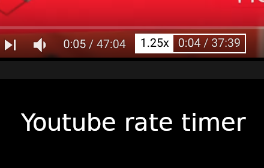

# youtube-speed-time-label

Change youtube time label when speed is not normal. That would help to estimate real time.
Add time label when you change the playback rate in video settings. 

Helping with understand with real time based on chosen playback rate.

Install link: https://chrome.google.com/webstore/detail/youtube-time-speed-label/lofmapcbgncddnmllimnfaakbkefmcdi/related?hl=ru&gl=RU
